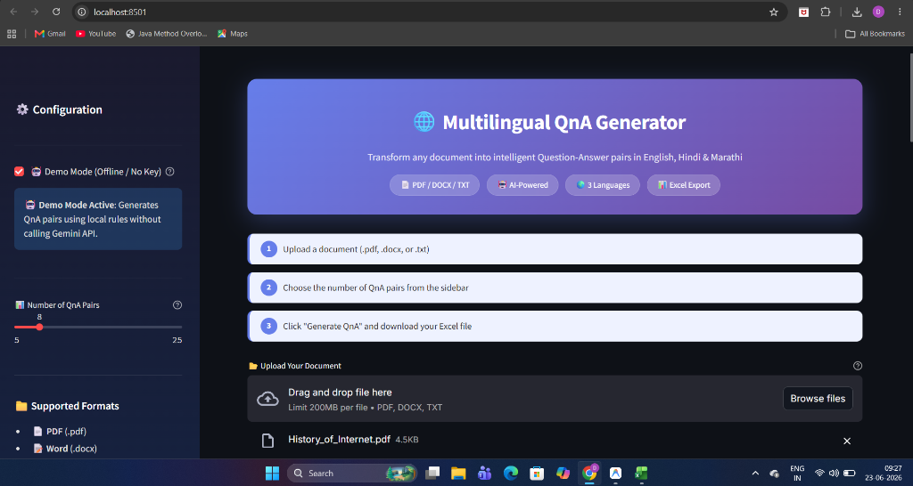
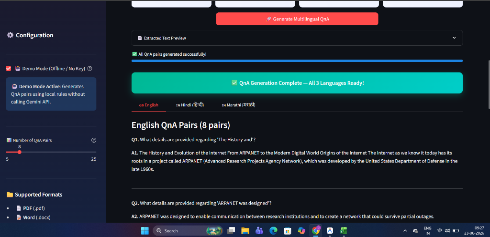
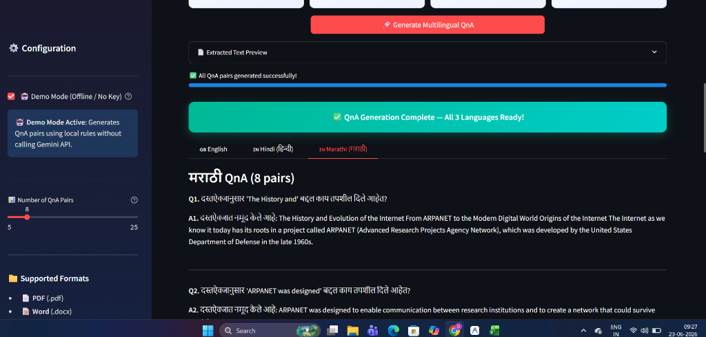

# 🌐 Multilingual Question-Answer (QnA) Generation System

An intelligent system that automatically generates meaningful and accurate Question-Answer (QnA) pairs from any input document, and outputs the results in three target languages: **English**, **Hindi (हिन्दी)**, and **Marathi (मराठी)**.

---

## 📌 Table of Contents

- [Overview](#overview)
- [Features](#features)
- [System Architecture](#system-architecture)
- [Tech Stack](#tech-stack)
- [Project Structure](#project-structure)
- [Setup & Installation](#setup--installation)
- [Usage](#usage)
- [Input Formats](#input-formats)
- [Output Format](#output-format)
- [Screenshots](#screenshots)
- [API Key Setup](#api-key-setup)

---

## 📖 Overview

This system accepts text-based documents in `.pdf`, `.docx`, or `.txt` format, processes the content using Google's Gemini AI, and automatically generates contextually relevant, accurate, and well-structured Question-Answer pairs in **three languages**:

1. **English** — Original QnA generation
2. **Hindi (हिन्दी)** — Translated QnA pairs
3. **Marathi (मराठी)** — Translated QnA pairs

The output is a single **Excel file (`QnA.xlsx`)** with three separate worksheets — one for each language.

---

## ✨ Features

| Feature | Description |
|---|---|
| 📄 Multi-format Input | Supports `.pdf`, `.docx`, and `.txt` file formats |
| 🌍 Trilingual Output | Generates QnA in English, Hindi, and Marathi |
| 🤖 AI-Powered | Uses Google Gemini API for intelligent QnA generation |
| 📊 Excel Export | Outputs a structured `.xlsx` file with 3 language sheets |
| 🎨 Streamlit UI | Beautiful, interactive web interface |
| ⚡ Real-time Progress | Visual progress tracking during generation |
| 🔧 Configurable | Adjustable number of QnA pairs (5–25) |
| 📝 Text Preview | View extracted text before generating QnA |

---

## 🏗️ System Architecture

```
┌─────────────────────────────────────────────────────────┐
│                   📂 Document Upload                     │
│              (.pdf / .docx / .txt)                       │
└──────────────────────┬──────────────────────────────────┘
                       │
                       ▼
┌─────────────────────────────────────────────────────────┐
│               📝 Text Extraction Module                  │
│         (PyPDF2 / python-docx / Built-in)                │
└──────────────────────┬──────────────────────────────────┘
                       │
                       ▼
┌─────────────────────────────────────────────────────────┐
│            🤖 QnA Generation (Gemini API)                │
│         Generates English QnA pairs from text            │
└──────────────────────┬──────────────────────────────────┘
                       │
              ┌────────┼────────┐
              ▼        ▼        ▼
         ┌────────┐ ┌───────┐ ┌─────────┐
         │English │ │ Hindi │ │ Marathi │
         │  QnA   │ │  QnA  │ │   QnA   │
         └────┬───┘ └───┬───┘ └────┬────┘
              │         │          │
              └────────┬┘──────────┘
                       │
                       ▼
┌─────────────────────────────────────────────────────────┐
│              📊 Excel Output (QnA.xlsx)                  │
│     Sheet 1: English | Sheet 2: Hindi | Sheet 3: Marathi│
└─────────────────────────────────────────────────────────┘
```

---

## 🛠️ Tech Stack

| Component | Technology |
|---|---|
| **Language** | Python 3.10+ |
| **UI Framework** | Streamlit |
| **AI Model** | Google Gemini 2.0 Flash |
| **PDF Parsing** | PyPDF2 |
| **DOCX Parsing** | python-docx |
| **Excel Generation** | openpyxl |
| **API Client** | google-generativeai |

---

## 📁 Project Structure

```
Assignment-Multilingual-Question-Answer-QnA-Generation-System/
│
├── app.py                  # Streamlit UI (main entry point)
├── document_parser.py      # PDF, DOCX, TXT text extraction
├── qna_generator.py        # Gemini-based QnA generation & translation
├── excel_writer.py         # Excel file creation with 3 styled sheets
├── generate_samples.py     # Script to generate sample test files
├── requirements.txt        # Python dependencies
├── .env.example            # Example environment config
├── .env                    # Your API key (local only, gitignored)
├── README.md               # Project documentation
│
└── sample_files/
    ├── sample.txt                # Sample text (AI overview)
    ├── ISRO_Space_Programme.txt  # Sample TXT test file
    ├── Climate_Change_Report.docx # Sample DOCX test file
    └── History_of_Internet.pdf   # Sample PDF test file
```

---

## 🚀 Setup & Installation

### Prerequisites

- Python 3.10 or higher
- Google Gemini API key ([Get one free here](https://aistudio.google.com/apikey))

### Step 1: Clone the Repository

```bash
git clone https://github.com/devanshudhoble/Assignment-Multilingual-Question-Answer-QnA-Generation-System.git
cd Assignment-Multilingual-Question-Answer-QnA-Generation-System
```

### Step 2: Install Dependencies

```bash
pip install -r requirements.txt
```

### Step 3: Configure API Key

Create a `.env` file in the project root (or copy from example):

```bash
cp .env.example .env
```

Then edit `.env` and add your Gemini API key:

```
GEMINI_API_KEY=your_gemini_api_key_here
```

> You can also enter the key directly in the Streamlit sidebar at runtime.

### Step 4: Run the Application

```bash
streamlit run app.py
```

The application will open in your default browser at `http://localhost:8501`.

---

## 📋 Usage

1. **Enter API Key** — Paste your Google Gemini API key in the sidebar.
2. **Upload Document** — Upload a `.pdf`, `.docx`, or `.txt` file.
3. **Configure** — Use the slider to set the number of QnA pairs (5–25).
4. **Generate** — Click the **"Generate Multilingual QnA"** button.
5. **Review** — Browse QnA pairs in the English, Hindi, and Marathi tabs.
6. **Download** — Click **"Download QnA.xlsx"** to get the Excel output file.

---

## 📂 Input Formats

The system accepts documents in the following formats:

| Format | Extension | Parser Used |
|---|---|---|
| Portable Document Format | `.pdf` | PyPDF2 |
| Microsoft Word Document | `.docx` | python-docx |
| Plain Text File | `.txt` | Built-in (multi-encoding) |

> **Note:** Input documents can be in English, Hindi, Marathi, or a mix of these languages.

---

## 📊 Output Format

### Excel File: `QnA.xlsx`

The output is a single Excel file with **three worksheets**:

| Sheet Name | Language | Content |
|---|---|---|
| **English** | English | QnA pairs in English |
| **Hindi** | हिन्दी | QnA pairs translated to Hindi |
| **Marathi** | मराठी | QnA pairs translated to Marathi |

Each sheet follows this format:

| Questions | Answers |
|---|---|
| What is AI? | AI refers to the simulation of human intelligence... |
| Who coined the term AI? | John McCarthy coined the term in 1956... |

### Excel Styling

- ✅ Color-coded sheet tabs (Blue/Orange/Green)
- ✅ Bold, styled headers with theme colors
- ✅ Alternating row colors for readability
- ✅ Frozen header row
- ✅ Auto-adjusted column widths
- ✅ Text wrapping enabled

---

## 🔑 API Key Setup

1. Visit [Google AI Studio](https://aistudio.google.com/apikey)
2. Sign in with your Google account
3. Click **"Create API Key"**
4. Copy the generated key
5. Paste it in the application's sidebar

> The **free tier** of Google Gemini API is sufficient for this application.

---

## 📸 Screenshots

### Main Interface
The application features a premium dark-themed sidebar with a gradient header and step-by-step workflow indicators.


### English QnA Generation (Demo Mode)
The system extracts text and generates high-quality Question-Answer pairs in English.


### Marathi QnA Translation (Demo Mode)
Question-Answer pairs are automatically translated into target languages (Hindi and Marathi) with natural language constructs.


---

## 🧪 Testing

A sample text file is provided in the `sample_files/` directory for quick testing:

```bash
# Upload sample_files/sample.txt through the UI
# Or use it directly for testing
```

---

## 📄 License

This project is developed as an assignment submission.

---

## 👤 Author

**Devanshu Dhoble**

- GitHub: [@devanshudhoble](https://github.com/devanshudhoble)
